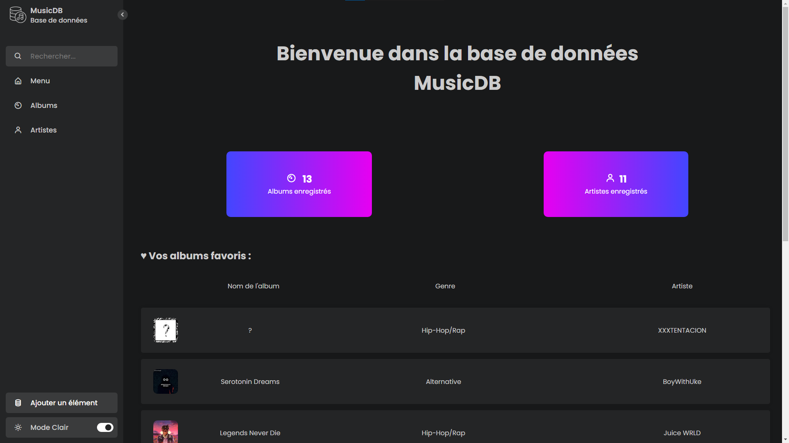
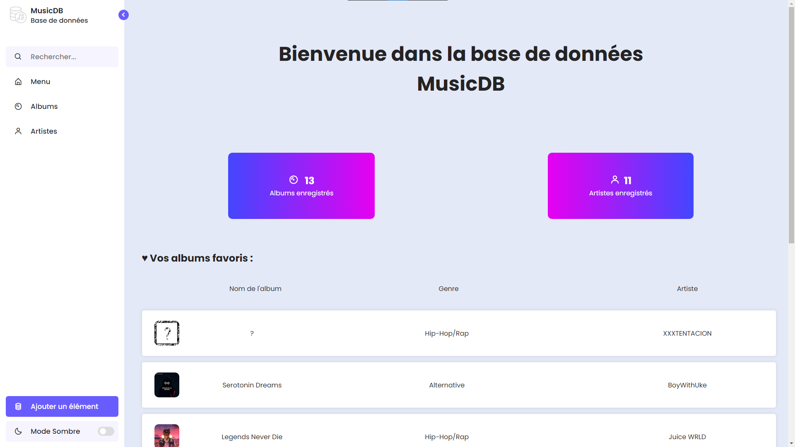
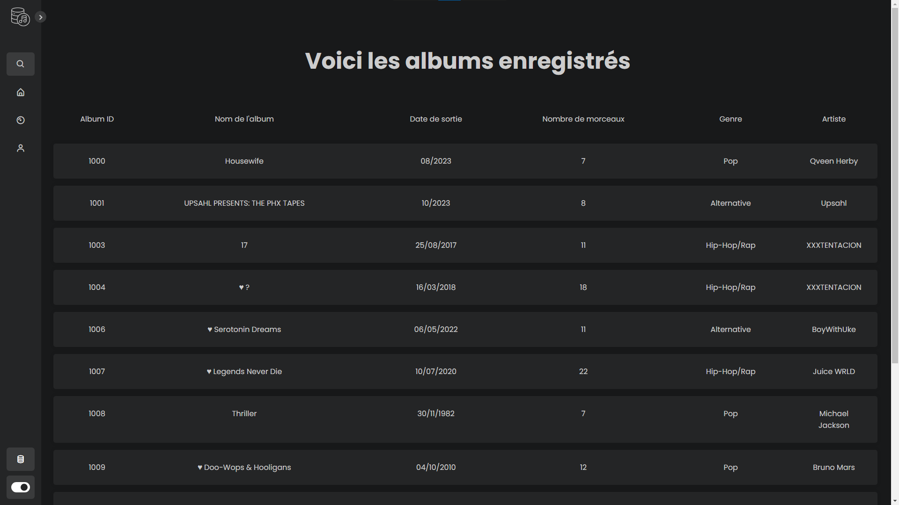
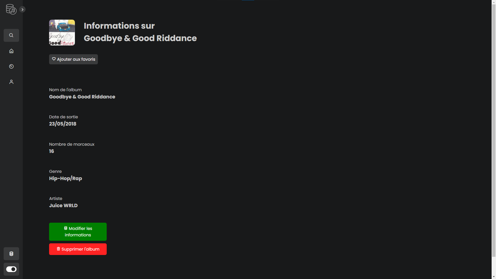
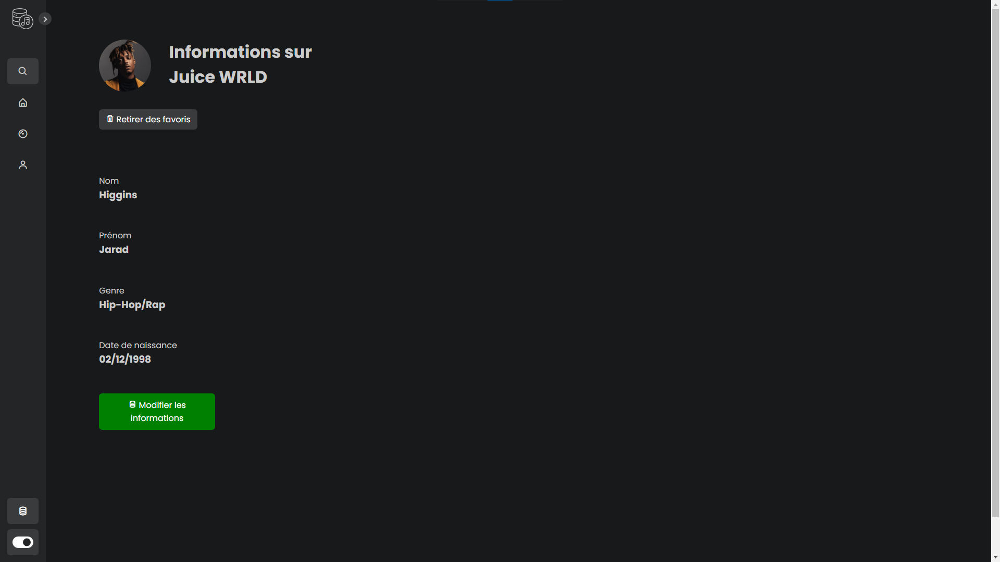

# Prérequis
- Installer un IDE Python (e.g. Thonny)
- Installer les bibliothèques suivantes :
  - Flask
  - sqlite3
  - fuzzywuzzy
  - requests

- Récupérer vos clés APIs [Genius](https://genius.com/api-clients/new) et [LastFM](https://www.last.fm/api/account/create)

# Intégration de vos clés APIs 

- Dans `api_key.py`, remplacez `votre-api-genius`par votre clé api Genius
- À la ligne **571**, remplacez `cle-api-lastFM` par votre clé api LastFM

# Lancement de l'application 

Après le téléchargement, lancez le fichier 'app.py' à la racine du dossier. 
Dans la console de votre IDE, deux URL apparaîtrons, ouvrez une des deux (de préférence la deuxième)  

⚠️ Evitez d'utiliser des navigateurs comme Mozilla Firefox. Ces derniers chargent mal certaines propriétés CSS ⚠️

Nous vous conseillons plutôt Google Chrome ou encore Microsoft Edge.

# Plus d'informations
Veuillez utiliser l'application en plein écran, sur un écran de 1920x1080 pixels et au format 16:9 pour une expérience optimale.

# Quelques images

Accueil de l'application en mode sombre :

En mode clair :

Affichage des albums :

Affichage d'un album :

Affichage d'un artiste :

